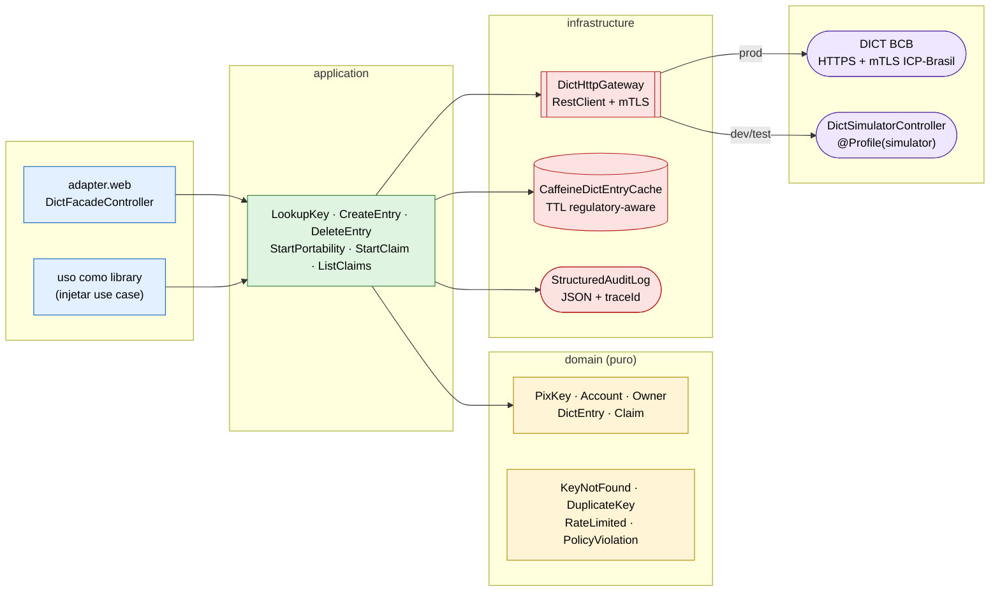
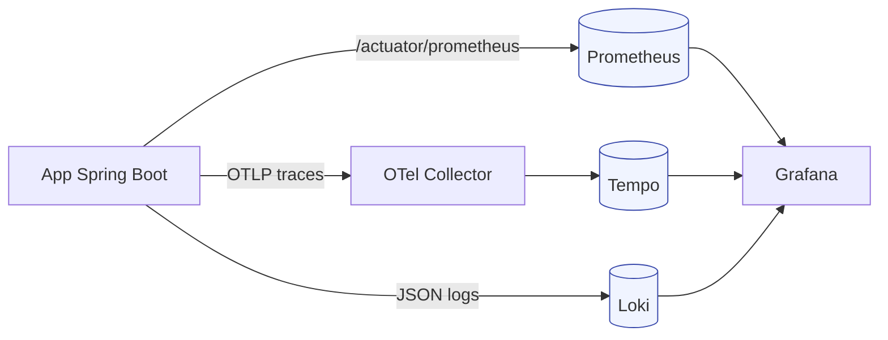

[](https://paulo-marcos-lucio.github.io)

<div align="center">

# DICT Client — Reference Implementation

**Cliente Java *production-grade* para o DICT (Diretório de Identificadores de Contas Transacionais) do Banco Central**

Spring Boot 3.4 + Java 21 · mTLS ICP-Brasil · Cache regulatory-aware · Resilience4j · OpenTelemetry · Simulador local

[](https://github.com/Paulo-Marcos-Lucio/dict-client-reference/actions/workflows/ci.yml)
[](https://github.com/Paulo-Marcos-Lucio/dict-client-reference/actions/workflows/codeql.yml)
[](https://github.com/Paulo-Marcos-Lucio/dict-client-reference/actions/workflows/release.yml)
[](./LICENSE)
[](https://openjdk.org/projects/jdk/21/)
[](https://spring.io/projects/spring-boot)
[](https://www.conventionalcommits.org/)
[](./CONTRIBUTING.md)

</div>

---

> **TL;DR** &nbsp;·&nbsp; Esta é a implementação que você procuraria se sua fintech precisasse integrar com o **DICT do Banco Central amanhã** e não pudesse errar. Hexagonal, mTLS ICP-Brasil pronto pra plugar certificado real, cache que respeita o TTL imposto pelo manual, Resilience4j defendendo da janela de rate limit do BCB, audit log com PII mascarada, observabilidade end-to-end e — o ponto-chave — um **simulador local** que implementa o contrato do DICT em memória pra você desenvolver e testar **sem precisar do certificado de produção**.

## Sumário

- [Por que existe](#por-que-existe)
- [Capacidades](#capacidades)
- [Arquitetura](#arquitetura)
- [Stack](#stack)
- [Quickstart](#quickstart)
- [Operações suportadas](#operações-suportadas)
- [Estrutura do projeto](#estrutura-do-projeto)
- [Cache TTL — conformidade BCB](#cache-ttl--conformidade-bcb)
- [mTLS e ICP-Brasil](#mtls-e-icp-brasil)
- [Simulador local](#simulador-local)
- [Estratégia de testes](#estratégia-de-testes)
- [Observabilidade](#observabilidade)
- [ADRs](#adrs)
- [Roadmap](#roadmap)
- [Suíte de Referência Regulatória BR](#suíte-de-referência-regulatória-br)
- [Como contribuir](#como-contribuir)
- [Segurança](#segurança)
- [Licença](#licença)
- [Autor](#autor)

---

## Por que existe

O **DICT** é o serviço do Banco Central que mapeia **chaves Pix** (CPF, CNPJ, e-mail, telefone, EVP) para os dados da conta transacional do titular. Toda iniciação de Pix passa por uma consulta DICT — e cada participante (banco, fintech, PSP) é obrigado a integrar diretamente, com **mTLS via certificado ICP-Brasil**, respeitando rate limits, TTLs de cache regulatórios e fluxos de portabilidade/reivindicação.

A barreira de entrada é alta: documentação espalhada em manuais PDF do BCB, ausência de bibliotecas OSS de referência em Java, certificado real só liberado para participantes homologados, e qualquer erro de implementação (cache vencido, mTLS mal configurado, retry em endpoint não-idempotente) gera **multa regulatória ou bloqueio temporário** no Diretório.

Este repositório demonstra, em código real e executável, como uma integração **correta, auditável e resiliente** com o DICT deve ser — e roda 100% local via simulador, sem precisar do certificado de produção.

## Capacidades

| Categoria | O que está implementado |
|---|---|
| **Operações DICT** | Lookup, create entry, delete entry, start portability, start ownership claim, list claims, complete claim, cancel claim |
| **Modelo de domínio** | `PixKey` validado por tipo (CPF, CNPJ, EMAIL, PHONE, EVP), `Account`, `Owner`, `DictEntry`, `Claim` — puros, sem Spring |
| **mTLS** | `SslBundle` Spring Boot 3 — truststore ICP-Brasil + keystore do participante, configurável via `application.yml` |
| **Cache regulatório** | `CacheTtlPolicy` aplica TTL conforme manual DICT v3.x; chave com claim em aberto **nunca** é cacheada |
| **Resiliência** | Resilience4j por operação: `dict-lookup` (rate limiter), `dict-write` (circuit breaker + retry), `dict-claim` (retry conservador) |
| **Audit** | Log estruturado JSON com PII mascarada — cada operação registra `ispb`, `op`, `chave_mascarada`, `outcome`, `durationMs`, `traceId` |
| **Observabilidade** | OpenTelemetry traces + Prometheus metrics + Loki logs estruturados, **correlacionados por `traceId`** |
| **Simulador local** | `@Profile("simulator")` sobe um endpoint que implementa o contrato DICT em memória — testes IT batem nele |
| **Contratos** | OpenAPI 3 do facade demo autogerado via SpringDoc |
| **Decisões** | 6 ADRs documentando cada escolha arquitetural não trivial |
| **Testes** | Unit (domínio puro), application (use cases com mocks), arquitetura (ArchUnit), integração (cliente real vs simulator) |

## Arquitetura

Arquitetura **hexagonal** (Ports & Adapters). O domínio é puro: nem Spring, nem Jakarta. ArchUnit valida as fronteiras no CI.



Diagramas **C4** detalhados em [`docs/architecture/`](./docs/architecture/).

## Stack

| Camada | Tecnologia |
|---|---|
| Runtime | Java 21 (virtual threads) |
| App framework | Spring Boot 3.4 + Spring Web MVC + RestClient |
| Cache | Caffeine 3 (in-process) com TTL regulatory-aware |
| Resiliência | Resilience4j 2.2 |
| Tracing | OpenTelemetry → Tempo |
| Métricas | Micrometer → Prometheus → Grafana |
| Logs | Logback JSON estruturado → Loki |
| Segurança | Spring Security + mTLS via `SslBundle` (ICP-Brasil ready) |
| API docs | SpringDoc OpenAPI 3 |
| Testes | JUnit 5 · ArchUnit · WireMock · Spring Test · JaCoCo |
| Build | Maven 3.9 (wrapper) |
| Container | Buildpacks (Spring Boot OCI image) |
| CI/CD | GitHub Actions · CodeQL · Semgrep · Trivy · Dependabot |

## Quickstart

**Pré-requisitos:** JDK 21, Docker Desktop (opcional, só para a stack de observabilidade), ~2 GB de RAM livre.

```bash
# 1. Clonar
git clone https://github.com/Paulo-Marcos-Lucio/dict-client-reference.git
cd dict-client-reference

# 2. (Opcional) sobe stack de observabilidade — Otel, Prometheus, Tempo, Loki, Grafana
make up

# 3. Roda a app com simulador embutido (cliente DICT real bate no simulador in-process)
make run-sim

# 4. Testa via requests.http ou curl
curl -H "X-Payer-Ispb: 12345678" \
     http://localhost:8080/v1/dict/entries/EMAIL/loja@merchant.com
```

**Acessos:**

| Serviço | URL | Notas |
|---|---|---|
| Facade demo | http://localhost:8080/v1/dict/* | REST sobre os use cases |
| OpenAPI UI | http://localhost:8080/swagger-ui.html | contratos vivos |
| Actuator | http://localhost:8080/actuator | health, metrics, info |
| Grafana | http://localhost:3000 | login anônimo (admin) |
| Prometheus | http://localhost:9090 | |
| Tempo (traces) | http://localhost:3200 | acessar via Grafana |

**Targets úteis do Makefile:**

```bash
make up        # stack de observabilidade up
make down      # derruba (preserva volumes)
make test      # unit
make it        # unit + integration (cliente vs simulator)
make run       # roda app no profile local
make run-sim   # roda app + simulator no mesmo contexto
make image     # build OCI image
make clean     # mvn clean + docker volumes prune
```

## Operações suportadas

| Método | Path do facade | Operação DICT correspondente | Idempotente |
|---|---|---|---|
| `GET` | `/v1/dict/entries/{type}/{key}` | Lookup | ✅ |
| `POST` | `/v1/dict/entries` | Create entry | ⚠️ (uniqueness BCB) |
| `DELETE` | `/v1/dict/entries/{type}/{key}` | Delete entry | ✅ |
| `POST` | `/v1/dict/claims` | Start portability OR ownership claim | ⚠️ |
| `POST` | `/v1/dict/claims/{id}/acknowledge` | Acknowledge claim (donor) | ✅ |
| `POST` | `/v1/dict/claims/{id}/complete` | Complete claim | ✅ |
| `POST` | `/v1/dict/claims/{id}/cancel` | Cancel claim | ✅ |
| `GET` | `/v1/dict/claims?role=&ispb=` | List open claims | ✅ |

Exemplos prontos em [`requests.http`](./requests.http) (compatível com IntelliJ HTTP Client e VS Code REST Client).

## Estrutura do projeto

```
dict-client-reference/
├── src/main/java/dev/pmlsp/dict/
│   ├── domain/                 # puro: modelos, exceptions, ports
│   │   ├── model/              # PixKey, Account, Owner, DictEntry, Claim, value objects
│   │   ├── port/in/            # use case interfaces
│   │   ├── port/out/           # DictGateway, DictEntryCache, AuditLog
│   │   └── exception/
│   ├── application/            # use cases (lookup, entry, claim)
│   ├── infrastructure/         # implementações de portas de saída
│   │   ├── http/               # DictHttpGateway + RestClient + mTLS
│   │   ├── mtls/               # SslBundle config
│   │   ├── cache/              # Caffeine + CacheTtlPolicy
│   │   ├── audit/              # log estruturado
│   │   ├── observability/      # spans, métricas
│   │   ├── resilience/         # configs Resilience4j
│   │   ├── simulator/          # @Profile(simulator) — DICT in memory
│   │   └── config/             # properties, security, autoconfig
│   └── adapter/web/            # DictFacadeController, DTOs, exception handler
├── src/main/resources/
│   ├── application.yml
│   └── application-local.yml
│   └── application-simulator.yml
├── src/test/java/.../
│   ├── domain/                 # testes unitários puros
│   ├── application/            # use cases com ports mockados
│   ├── architecture/           # ArchUnit
│   └── integration/            # cliente vs simulator
├── config/                     # otel, prometheus, tempo, loki, grafana
├── docs/
│   ├── adr/                    # decisões arquiteturais
│   ├── architecture/           # C4 (context, container, component)
│   ├── compliance/             # mapeamento req BCB → código
│   └── flows/                  # fluxos das operações DICT
├── compose.yaml                # stack de observabilidade
├── Makefile                    # DX: up/down/test/it/run/run-sim/image
└── pom.xml
```

## Cache TTL — conformidade BCB

O manual do DICT impõe TTLs **máximos** que cada participante deve respeitar. Cachear acima do limite gera divergência operacional e pode resultar em sanção. `CacheTtlPolicy` é a fonte da verdade — não cacheia além do permitido, mesmo se config pedir.

| Tipo de chave | TTL recomendado | TTL máximo BCB |
|---|---|---|
| `EVP` (aleatória) | 30 s | 60 s |
| `CPF` | 30 s | 60 s |
| `CNPJ` | 60 s | 300 s |
| `EMAIL` | 60 s | 300 s |
| `PHONE` | 60 s | 300 s |
| **Chave com claim em aberto** | **0 (sem cache)** | **0** |

> Os valores acima são os utilizados como referência neste projeto e podem divergir do manual vigente — sempre confirme contra a versão atual do *Manual de Operações do DICT* publicado pelo BCB.

## mTLS e ICP-Brasil

A produção do DICT exige mTLS com certificado **ICP-Brasil A1** emitido para o participante (banco/fintech homologado). Este projeto:

- Usa `SslBundle` do Spring Boot 3 — referenciado por nome no `application.yml` (`spring.ssl.bundle.jks.dict-prod`)
- Truststore com cadeia ICP-Brasil válida — não commitada no repo
- Keystore do participante (privada) — não commitada, carregada de path local ou secret manager
- `make certs` gera material de **teste** em `certs/` (gitignored) para desenvolvimento

Em modo `simulator` ou `local`, mTLS é desativado — o cliente HTTP usa TLS simples ou HTTP plain contra o simulador local.

Detalhes em [ADR 0002](./docs/adr/0002-mtls-icp-brasil.md).

## Simulador local

`DictSimulatorController` (ativo no profile `simulator`) implementa o contrato HTTP do DICT em memória:

- 5 chaves pré-populadas (uma de cada tipo) em `InMemoryDictStore`
- Comportamento configurável via `dict.simulator.behavior.*`:
  - `failure-rate` — proporção de respostas com erro 5xx
  - `latency-jitter-ms` — latência adicional simulada
  - `unavailable-after` — para parar de responder e exercitar o circuit breaker
- Roda no **mesmo Spring context** da app via `make run-sim`, ou como processo separado em outra porta para fechar o loop end-to-end
- Não emite eventos, não persiste, não suporta TLS — é deliberadamente simples para isolar o que está sendo testado: o cliente

Detalhes em [ADR 0006](./docs/adr/0006-simulador-local.md).

## Estratégia de testes

| Tipo | Onde | Ferramentas | O que valida |
|---|---|---|---|
| Unitário | `domain/`, `application/` | JUnit 5 + AssertJ | Validação de chaves, regras de cache TTL, orquestração de use cases |
| Arquitetura | `architecture/` | ArchUnit | Camadas hexagonais não vazam (domínio sem Spring etc.) |
| Integração | `integration/` | `@SpringBootTest` + simulator no contexto | Fluxo cliente → HTTP → simulator → resposta → cache |
| Cobertura | — | JaCoCo | Reporta no PR via Codecov |

**Regra de ouro:** integração nunca usa mock para o gateway HTTP — sempre o simulador real. Mock nesse ponto é dívida técnica disfarçada de teste rápido.

## Observabilidade

Tudo correlacionado por `traceId` propagado via W3C Trace Context.



**Métricas customizadas (Micrometer → Prometheus):**

| Métrica | Tipo | Tags | Descrição |
|---|---|---|---|
| `dict.operation.duration` | Histogram + percentiles (p50/p95/p99) + SLO buckets (50ms, 100ms, 250ms, 500ms, 1s) | `op`, `outcome` | Latência por operação e desfecho |
| `dict.cache.hit` | Counter | `keyType` | Cache hits do lookup |
| `dict.cache.miss` | Counter | `keyType` | Lookups que tiveram que ir ao gateway |
| `dict.cache.size` | Gauge | — | Entradas atualmente no cache local |
| `dict.cache.max_size` | Gauge | — | Capacidade máxima configurada |
| `dict.gateway.errors` | Counter | `errorClass` | Erros do gateway por tipo de exception |
| `dict.simulator.failures.injected` | Counter | — | Falhas sintéticas injetadas pelo simulador (debug) |
| `dict.simulator.jitter.applied` | Counter | — | Requests que receberam latência sintética |

**Span tags em cada operação:** `dict.operation`, `dict.key.type`, `dict.key.masked`, `dict.ispb`, `dict.outcome`.

**Logs:** JSON com `traceId`, `spanId`, `dict.op`, `dict.keyMasked`, `dict.outcome`, `dict.durationMs` — joinable com traces no Grafana via derived field.

### Dashboards Grafana versionados

Dois dashboards são provisionados automaticamente quando a stack sobe (`make up`) — código em [`config/grafana/dashboards/`](./config/grafana/dashboards):

| Dashboard | UID | O que mostra |
|---|---|---|
| **DICT — Operations Overview** | `dict-overview` | Stat panels (ops/sec, cache hit %, error %, p99), throughput por op + outcome (stacked), latência p50/p95/p99 por operação, cache hits vs misses por keyType, evolução do tamanho do cache, erros por classe |
| **DICT — Resilience & JVM** | `dict-resilience` | Estado dos 3 circuit breakers (lookup/write/claim), CB calls por kind, retry attempts, rate limiter (permitted/waiting/rejected), falhas injetadas pelo simulator, JVM heap, threads, latência HTTP server |

Acesso: http://localhost:3000 → Dashboards → DICT Client.

### Observabilidade em ação (3 comandos)

```bash
make up         # otel + prometheus + tempo + loki + grafana
make run-sim    # app + simulador in-process em :8080
make load       # tráfego sintético (existing keys + unknowns) em loop
```

Dali, abre o Grafana e os painéis populam em ~10s. Pra exercitar resiliência, edite `application.yml` antes de `make run-sim`:

```yaml
dict:
  simulator:
    failure-rate: 0.30        # 30% de 5xx sintéticos
    latency-jitter: 200ms     # jitter aleatório até 200ms
```

E veja `dict-resilience` mostrando o circuit breaker abrir/fechar, retry attempts subir, e `dict.simulator.failures.injected` correlacionado com `dict.gateway.errors`.

## ADRs

| # | Decisão |
|---|---|
| [0001](./docs/adr/0001-hexagonal-architecture.md) | Arquitetura hexagonal (Ports & Adapters) |
| [0002](./docs/adr/0002-mtls-icp-brasil.md) | mTLS via `SslBundle` com cadeia ICP-Brasil |
| [0003](./docs/adr/0003-cache-ttl-regulatorio.md) | Cache TTL regulatory-aware (clamp ao máximo BCB) |
| [0004](./docs/adr/0004-resilience-strategy.md) | Estratégia de resiliência por grupo de operação |
| [0005](./docs/adr/0005-observability-correlation.md) | Observabilidade correlacionada por `traceId` |
| [0006](./docs/adr/0006-simulador-local.md) | Simulador local in-process do DICT |

## Test Coverage & API Docs

| Categoria | Tests |
|---|---|
| Unit (incl. ArchUnit) | 21 |
| Integration (vs simulator) | 3 |
| **Total** | **24** |

JaCoCo coverage report gerado em `target/site/jacoco/index.html` após `./mvnw verify`.

**API Documentation** (live com a app rodando em `http://localhost:8080`):
- Swagger UI: <http://localhost:8080/swagger-ui.html>
- OpenAPI 3 spec (JSON): <http://localhost:8080/v3/api-docs>
- Geração offline do spec:
  ```bash
  ./mvnw spring-boot:run    # em outro terminal (sobe DICT facade demo na :8080)
  curl http://localhost:8080/v3/api-docs > docs/openapi.json
  ```

## Roadmap

- [ ] Suporte a XML signing (XMLDSig) para operações que o BCB exige assinatura no payload
- [ ] Cliente XML/SOAP para endpoints legados do DICT
- [ ] Bridge opcional para Redis (cache distribuído quando rodar com múltiplas réplicas)
- [ ] Integração com Hashicorp Vault para keystore (substitui keystore em disco)
- [ ] Reconciliação periódica de claims abertas (cron + listagem)
- [ ] Helm chart para deploy em Kubernetes
- [ ] Benchmark de latência (p99 < 100ms para `lookup` em cache, < 500ms para miss)

Veja [issues abertas](https://github.com/Paulo-Marcos-Lucio/dict-client-reference/issues) para o detalhe.

## Suíte de Referência Regulatória BR

Este repositório faz parte de uma suíte mantida pelo autor cobrindo integrações regulatórias do mercado financeiro brasileiro:

| Repo | Foco |
|---|---|
| [`pix-automatico-reference`](https://github.com/Paulo-Marcos-Lucio/pix-automatico-reference) | Pix Automático + Open Finance Fase 4 (cobrança recorrente) |
| **`dict-client-reference`** ← você está aqui | DICT (diretório de chaves Pix) |
| `pix-nfc-reference` *(em breve)* | Pix por aproximação (NFC) |
| `open-finance-payments-reference` *(em breve)* | Open Finance Brasil — Iniciação de Pagamentos |
| `open-insurance-transmissor-reference` *(em breve)* | Open Insurance Brasil (OPIN) |

## Como contribuir

PRs muito bem-vindas. Leia [`CONTRIBUTING.md`](./CONTRIBUTING.md) — em resumo:

- Conventional Commits
- Testes obrigatórios para mudanças funcionais
- ADR para decisões não triviais
- ArchUnit não pode regredir

## Segurança

Para reportar vulnerabilidade, **não abra issue pública**. Use [Security Advisories](https://github.com/Paulo-Marcos-Lucio/dict-client-reference/security/advisories/new). Detalhes em [`SECURITY.md`](./SECURITY.md).

## Licença

[MIT](./LICENSE) © 2026 Paulo SP.

## Autor

Construído por **Paulo SP** — [@Paulo-Marcos-Lucio](https://github.com/Paulo-Marcos-Lucio) no GitHub, [LinkedIn](https://www.linkedin.com/in/paulo-marcos-a07379174/) — como referência pública para **consultoria em integrações regulatórias** (Pix Automático, Open Finance, Open Insurance).

> Sua empresa precisa de revisão de arquitetura ou implementação de cliente DICT / Pix em Java? Me chama no [LinkedIn](https://www.linkedin.com/in/paulo-marcos-a07379174/) ou abre uma [issue de contato](https://github.com/Paulo-Marcos-Lucio/dict-client-reference/issues/new?labels=contact).

---

<div align="center">

**Se este repositório te ajudou, deixa uma ⭐ — ajuda outros engenheiros a encontrarem.**

</div>
