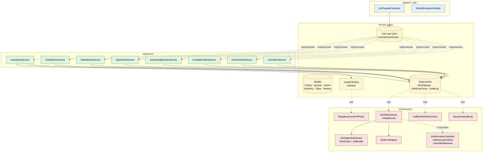

# C4 — Level 3: Component (zoom into use cases + adapters)

## Read order

1. **Start with `domain/`** — models and ports define what's possible.
2. **Read a use case** (e.g. `LookupKeyService`) — see how it composes ports and how it audits each step.
3. **Read the gateway** (`DictHttpGateway`) to understand the HTTP contract, error mapping, and Resilience4j placement.
4. **Read the simulator** (`DictSimulatorController`) — same contract, no transport security, deterministic behavior.

Boundaries are enforced by `HexagonalArchitectureTest` — domain has zero Spring/Jakarta dependency, application depends only on domain, adapter is a leaf, infrastructure is the only place that knows about HTTP, Caffeine, Logstash etc.
