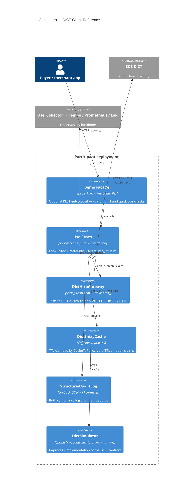

# C4 — Level 2: Containers

## Notes

- The **simulator** is just another container in the same JVM — the gateway sees the same HTTP contract, the network is loopback. This is what makes integration tests credible without external dependencies.
- The **audit sink** doubles as the metric source so the metric and audit views never disagree.
- The **cache** is per-instance (Caffeine). Multi-replica deployments can plug a Redis-backed implementation of `DictEntryCache` without touching the use cases — that's the point of the hexagonal split.
