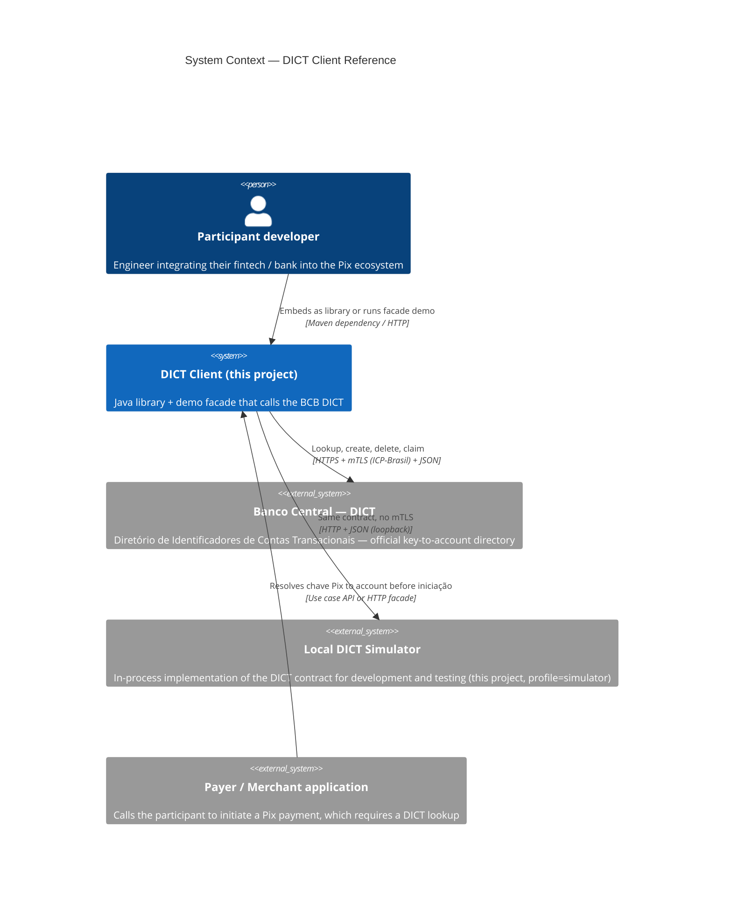

# C4 — Level 1: Context

## Macro flow

1. Payment app needs to initiate a Pix to a key — calls the participant's gateway, which uses this client to resolve the key into an account.
2. Client checks local cache. On hit (and key has no claim in flight), returns immediately.
3. On miss, client makes an HTTPS request to the DICT (mTLS in production, plain HTTP to the simulator in dev/test).
4. Response is mapped to domain types, audited, optionally cached, returned.
5. Same client also issues writes (create/delete) and claim operations (portability/ownership) on demand.
