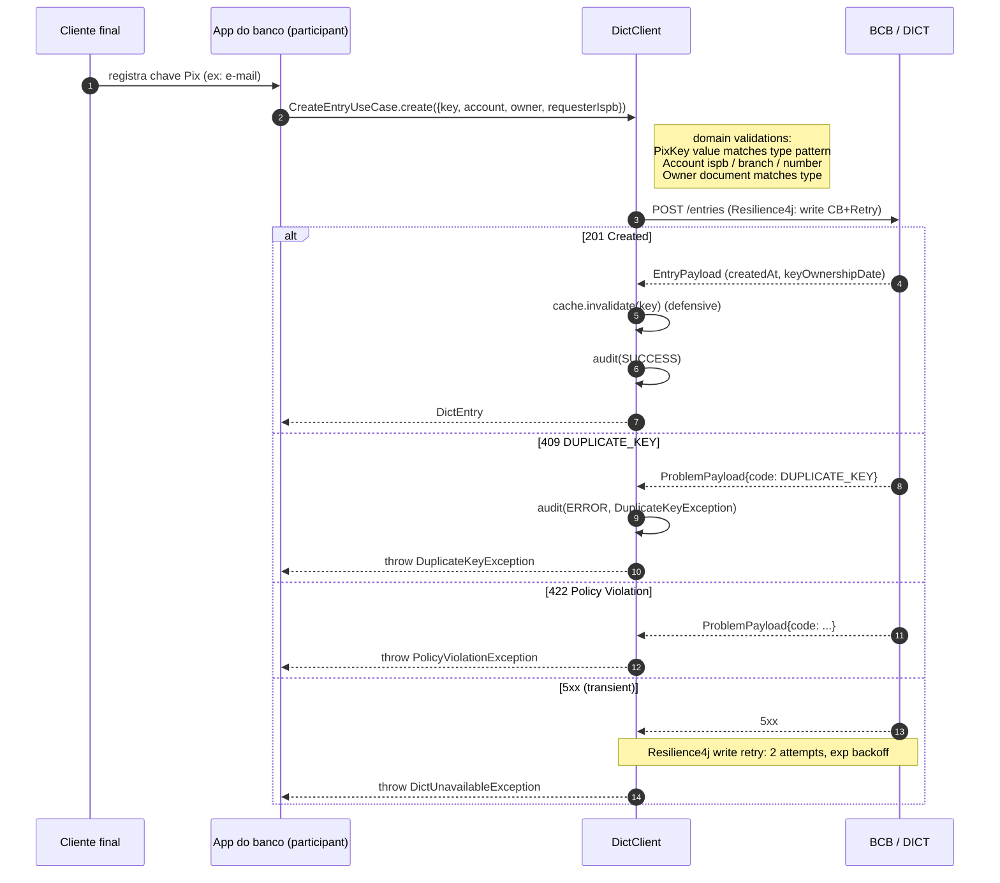

# Flow — Criar entry (registrar chave Pix)

## Garantias

- **Write não retenta erros 4xx** — apenas 5xx / timeout. 4xx é sinal de input inválido ou conflito real, não falha transitória.
- **Cache é invalidado** mesmo em writes bem-sucedidos — garante que próximos lookups peguem o estado fresco do DICT (createdAt, keyOwnershipDate corretos).
- **Cliente nunca tenta unique-check local** — a unicidade é responsabilidade do DICT (única fonte da verdade).
