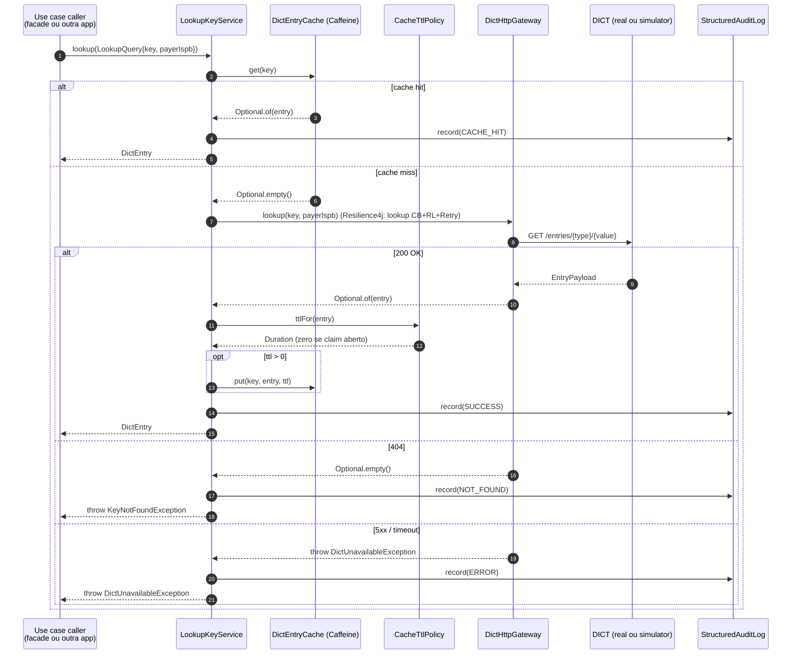

# Flow — Lookup de chave Pix

## Garantias

- **Cache hit nunca leva ao DICT** — minimiza latência e quota.
- **Open claim entries nunca entram no cache** — `CacheTtlPolicy` retorna zero, e `LookupKeyService` ignora valores zero.
- **Erros transitórios (5xx, timeout) entram no `dict-lookup` retry/CB** — sem afetar o operador.
- **Erros determinísticos (404, 422) sobem direto** — não retentam.
