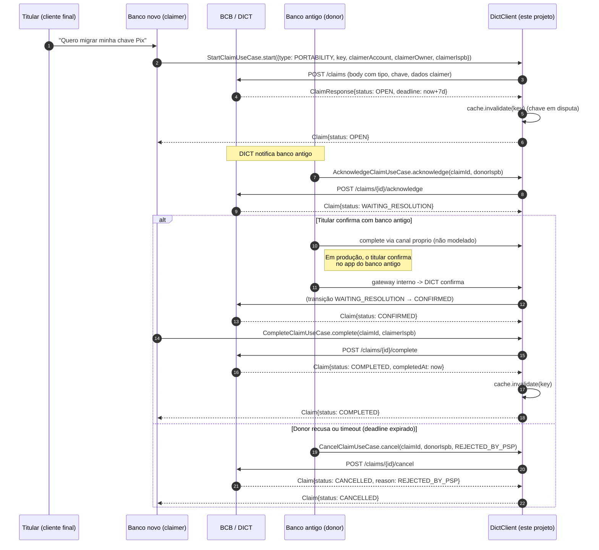

# Flow — Portability claim (chave muda de banco)

## Pontos críticos

- **Janela de 7 dias** (definida em `ClaimType.PORTABILITY.resolutionWindow()`).
- **Cache da chave é invalidado** ao iniciar e ao completar o claim — qualquer cliente que tinha a chave em cache buscará no DICT (que retornará a entrada com `openClaimType` durante a janela).
- **Claim em aberto bloqueia novo claim** sobre a mesma chave — DICT retorna 409 + `CLAIM_CONFLICT`, mapeado para `ClaimConflictException`.
- **Resolution deadline é informativa** — o DICT cancela automaticamente o claim se não houver resolução até `requestedAt + 7d`. O cliente não precisa rodar timer próprio, mas pode listar claims abertas perto do deadline para tomar ação.

## Diferenças vs Ownership claim

`OWNERSHIP` segue exatamente o mesmo fluxo, mas:
- Janela é de 30 dias.
- A confirmação envolve revisão antifraude do donor — não é apenas "autorizar" do titular.
- O risco operacional é maior (alguém alegando posse contra o titular legítimo) — o donor deve rejeitar liberalmente quando há suspeita.
